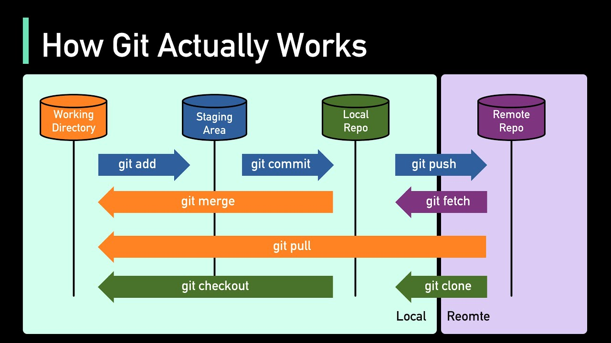

# Git Commands

- [Git Flags](./GIT_FLAG.md)
- [Git Commands Combinations](./GIT_COMMAND_COMBINATION.md)
- [Git Safe Commands](./GIT_SAFE_COMMAND.md)


## 1. 기본 개념

#### Working Directory
- 실제로 파일을 수정하고 개발하는 공간
- WD에서 수정/삭제를 하게 되면?
  - “Git 스냅샷에 반영되지 않을 뿐”임. 로컬 파일시스템에서 지운 건 OS 차원에선 지워진 거지만, 이전에 커밋해 둔 상태가 있다면 git checkout -- <file>(요즘은 git restore <file>) 등으로 그 시점으로 복원할 수 있음.

#### Staging Area (aka Index)
- 변경된 내용을 임시로 올려서 "커밋할 준비"를 하는 공간 (`git add`로 올리고, `git commit`으로 저장소에 반영)

#### Local Repository
- 내 PC에 있는 Git 저장소 (.git 폴더)
- 로컬 저장소는 .git 폴더 전체(객체 DB .git/objects, 인덱스 .git/index, 참조 .git/refs, 설정 .git/config, HEAD 등)임!!! HEAD는 그중 하나의 파일일 뿐.

#### 원격 저장소(Remote Repository)
- GitHub, GitLab, Bitbucket 같은 서버에 있는 저장소  
- 협업 시 이 원격 저장소를 사용해 코드 공유

#### Branch
-DAG(방향성 비순환 그래프)를 사용해 구현. 각 커밋은 하나(또는 여러 개)의 부모를 가리키며, 브랜치/태그는 그 커밋을 가리키는 포인터임.
- 브랜치는 “별도 복사본”이 아니라 커밋을 가리키는 가벼운 포인터. 스냅샷은 커밋 객체에 있고, 브랜치는 단지 “어떤 커밋을 최신으로 볼지”를 가리킮

#### HEAD (현재 작업 중인 branch 라고 생각하면 편함)
- 현재 체크아웃한 브랜치를 가리키는 포인터 (보통 refs/heads/<branch>), 또는 detached HEAD 상태에서는 바로 특정 커밋을 가리키는 포인터
---

## 2. 초기 설정

```bash
git init                   # 현재 디렉토리를 Git 저장소로 초기화
git clone [url]            # 원격 저장소를 복제해서 가져오기 => 이때 git clone 이후 git checkout 까지 함께 실행되어, 별도 checkout/switch 를 안 해도 바로 작업 가능 (원격의 HEAD가 가리키는 브랜치, 보통 main로 이동)
```

---

## 3. 변경 사항 관리 (Stage & Commit)

```
git status                 # Working dir ↔ Staging area ↔ 현재 branch(HEAD) 의 차이를 요약해서 보여줌
git add [파일명]            # 수정된 파일을 스테이징에 추가
git reset [파일명]          # 스테이징에서 내리기 (수정은 남김)
git diff                   # 수정됐지만 스테이징 안 된 내용 확인
git diff --staged          # 스테이징된 변경 내용 확인
git commit -m "메시지"      # 커밋 생성
git restore --staged .      # 잘못 스테이징한 것 되돌리기 (특정 파일만 이전 커밋/브랜치 상태로 롤백)
```

#### git status 추가 설명
- Changes not staged for commit: 워킹 디렉터리에서 바뀌었지만 git add 안 된 것
- Changes to be committed: 스테이징 완료, 커밋 준비됨
- Untracked files: Git이 아직 추적 안 하는 새 파일
---

## 4. 브랜치 & 병합

```
git branch                 # 브랜치 목록 확인
git branch [이름]           # 새 브랜치 생성
git checkout [이름]         # 브랜치 이동
git checkout -b [이름]      # 브랜치 생성 후 이동
git merge [브랜치명]        # 브랜치 병합
git merge-base [브랜치명1] [브랜치명2]      # 두 브랜치의 공통 조상(commit hash)을 보여줌 => commit hash를 보여준다는게 핵심!
git cherry-pick [커밋ID]    # 특정 커밋만 현재 브랜치에 반영
git branch -d [이름]        # 안전 브랜치 삭제 => 해당 브랜치가 현재 브랜치(보통 main)로 병합된 경우에만 삭제
git branch -D [이름]        # 강제 브랜치 삭제 => 병합 안 돼도 삭제. 실수로 작업 잃을 수 있어 주의
git push origin --delete 브랜치명   # 원격 브랜치 삭제
```
---

## 5. 기록 & 비교

```
git log                          # 커밋 로그 확인
git log --oneline --graph --all  # 한 줄 로그 + 브랜치 그래프 보기
git log branchB..branchA         # A에는 있지만 B에는 없는 커밋 보기
git log --follow [파일명]         # 파일의 변경 이력 확인
git show [커밋ID]                # 특정 커밋 상세 보기
git blame [파일명]               # 파일별 줄 단위 작성자/커밋 확인
```
---

## 6. 원격 저장소와 동기화

```
git remote add origin [url]    # 원격 저장소 추가
git fetch origin               # 원격 저장소 최신 이력 가져오기 (병합은 안 함)
git merge origin/[브랜치]      # 원격 브랜치를 현재 브랜치에 병합
git pull                       # 원격 변경 내용을 가져와 병합
git push origin [브랜치]       # 로컬 커밋을 원격에 업로드
```

#### git fetch 추가 설명
- git fetch는, remote의 새 commit/branch 정보를 로컬의 remote tracking branch(refs/remotes/origin/*)에만 업데이트함.
- Working dir이나 local branch 내용은 안 바뀜! 이후 merge나 rebase로 로컬 브랜치에 통합해야 함.
#### git pull = git fetch + git merge (기본).
#### git config pull.rebase true면 fetch + rebase.
 
---

## 7. 파일 & 경로 관리

```
git rm [파일명]               # 파일 삭제 => 실제 파일 삭제 + 추적 제거. 추적만 끊고 파일은 남기려면 git rm --cached <file>
git rm --cached [파일명]       # git 추적만 끊기 (파일은 dir에 남아있음)
git rm -r [폴더명]            # 폴더 삭제 (-r는 recursive하게 폴더 내부의 내용을 다 삭제하라는 뜻)
git mv [이전경로] [새경로]     # 파일 이동 또는 이름 변경 후 스테이징
git log --stat -M             # 파일 이동/이름 변경 포함 로그 보기
```
---

## 8. 기록 수정 & 되돌리기

```
git reset --soft [커밋 ID]     # 커밋은 취소하지만, 스테이징 및 working directory 상태는 그대로 남겨두기 => “방금 커밋을 했는데 메시지만 바꾸고 싶어!”
git reset --mixed [커밋 ID]     # 커밋도 취소하고, 스테이징도 풀어버리지만 파일 수정 내용은 working directory에 존재 => “커밋도 취소하고 add도 잘못했네. 하지만 내용은 살려야지.”
git reset --hard [커밋ID]     # 커밋 취소 + 스테이징 취소 + working directory의 수정한 파일까지 전부 없애고 특정 시점으로 완전히 돌아가기 => “진짜 다 꼬였어. 그냥 어제 상태로 완전히 되돌려!”
# 주의: 되돌린 내용은 reflog 없으면 못 찾음 → 반드시 신중히

git revert [커밋ID]           # 이미 원격에 올린(공유된) 커밋을 안전하게 되돌릴 때 => push 후에 사용해도 안전!
git rebase [브랜치]           # 현재 브랜치를 지정한 브랜치 위로 재배치 => 히스토리를 깔끔하게 직선으로 유지하고 싶을 때
git squash        # 보통 머지 시 한 뭉치로 합치기(git merge --squash) 또는 인터랙티브 리베이스로 여러 커밋을 하나로(git rebase -i, squash/fixup)를 뜻함. “머지 커밋 없이 변경만 합치고 단일 커밋으로 올리자”는 의도일 때 많이 씀.
```
#### git revert [커밋ID] 추가 설명
- 만약 git revert로, remote repo의 최근 3개의 커밋에서 가장 오래된 커밋으로 되돌아가고 싶다고 가정하자.
- git revert [3번째 커밋ID] 를 실행하면, 커밋의 변경을 되돌리는 “새 커밋” 을 추가할 뿐, 기존 커밋들(최근 2개)을 삭제하지 않음(히스토리 보존)
- 이미 푸시한 이력은 revert가 안전한 선택임 => reset --hard로 되돌리면 원격 이력과 충돌!

#### git rebase [브랜치] 추가 예시
- 상황: feature/login 작업 중인데, 팀이 main에 여러 커밋을 더 넣음. 내 브랜치를 최신 main 뒤에 “옮겨 적어” 충돌을 지금 해결하고, 나중 머지 충돌을 줄이고 싶다.
```
git checkout feature/login
git fetch origin
git rebase origin/main
# 충돌 나면 파일 수정 → git add <파일들> → git rebase --continue 
# 중단하려면 git rebase --abort
git push --force-with-lease origin feature/login   # rebase 후엔 보통 필요
```
- 상황: 협업 중 “pull할 때마다 merge 커밋”이 생기는 게 싫다.
```
git config pull.rebase true
# 또는 매번:
git pull --rebase
```

#### git merge VS. git rebase
- merge: 두 브랜치의 공통 조상 이후 변경들을 하나로 합쳐 머지 커밋을 만듦.
- rebase: 현재 브랜치의 커밋들을 대상 브랜치 끝으로 “다시 적용” 해서 선형 히스토리로 만듦(커밋 해시가 바뀌는 히스토리 재작성).
- 
#### 둘 다 충돌 날 수 있음. rebase가 conflict를 없애주지 않음. 다만 rebase는 히스토리가 깔끔해지고 git bisect/git log --oneline --graph 가 읽기 쉬워짐

---

## 9. 임시 저장 (stash)
- 작업 도중 브랜치를 바꿔야 하거나, 깨끗한 상태로 테스트/풀 받기 위해 임시로 치워둘 때 자주 씀.
- git pull --rebase --autostash처럼 pull 직전에 자동 stash/pop 도 가능.
```
git stash                     # 변경 사항 임시 저장
git stash push [파일경로]    # 특정 변경 파일만 임시 저장
git stash push -m "[메세지]" [파일 경로]    # 특정 변경 파일만 임시 저장 + 메세
git stash list                # stash 목록 확인
git stash pop                 # 가장 최근 stash 적용 + 제거
git restore -s "stash@{[stash 번호]}" -- [파일 경로]    # 특정 파일만 복원
# git checkout -s "stash@{[stash 번호]}" -- [파일 경로] 도 가능
git stash drop                # stash에서 제거
```
---

## 10. 실무에서 유용한 추가 명령어

```
git commit --amend            # 가장 최근 커밋 메시지 수정 (push 전만 사용)
git push -f origin [브랜치]   # 강제로 push (주의!)
git fetch -p                  # 원격에서 삭제된 브랜치 로컬에서도 정리 => 예) 팀에서 feature/x를 원격에서 삭제했다면, git fetch -p를 하면 로컬의 origin/feature/x가 사라져 목록이 깔끔해짐
git clean -fd                 # 추적되지 않은 파일/폴더 삭제
git reflog                    # HEAD 이동 기록 보기 (reset, checkout 포함) => 예를 들어 커밋을 실수로 날려도 복구 가능
git shortlog -sn              # 커밋한 사람별 통계 확인
```
---

## 자주 쓰는 명령어 TOP 10 (실무 기준)

```
git status

git add .

git commit -m "메시지"

git log --oneline --graph --all

git checkout -b feature/기능명

git merge 브랜치명

git pull

git push origin 브랜치명

git stash / git stash pop

git reset --hard [커밋ID] (push 전 실수 정정)
```
---
